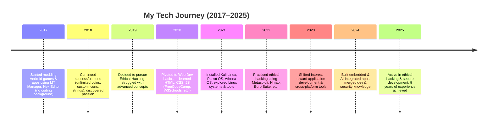

<!--# ██▓▒­░⡷⠂𝚄𝚂𝙴𝚁 𝙸𝙽𝙵𝙾𝚁𝙼𝙰𝚃𝙸𝙾𝙽⠐⢾░▒▓██

<h1 align="center">Hi 👋, I'm 🅙🅔🅓🅝🅐🅩</h1>
-->
<h5 align="center">My old account was suspended.</h5>
 

  

# Other Accounts
- <a href="https://codeberg.org/jednaz_lonestamp">CodeBerg</a>
- <a href="https://bitbucket.org/lonestamp">Bitbucket</a>
- <a href="https://sourceforge.net/u/lonestamp99/profile">SourceForge</a>
# Social Accounts
- <a href="">Facebook</a>
- <a href="">Vkontakte</a>
- <a href="">Rossgram</a>
- <a href="">Yappy</a>
- <a href="">Instagram</a>

# Interests

- 🤖 Mechatronics Engineering  
- ⚛️ Physics  

## 🕒 9-Years

  

## 🅸'🅼 🅻🅸🆂🆃🅴🅽🅸🅽🅶 🆃🅷🅸🆂 🅼🆄🆂🅸🅲
|         |         |         |
| ------- | ------- | ------- |
|  |  |  |
<!--
- 🔭 ꧁༺ 𝓘’𝓶 𝓬𝓾𝓻𝓻𝓮𝓷𝓽𝓵𝔂 𝔀𝓸𝓻𝓴𝓲𝓷𝓰 𝓸𝓷:༻꧂ 

- 🌱  ꧁༺ 𝓘’𝓶 𝓬𝓾𝓻𝓻𝓮𝓷𝓽𝓵𝔂 𝓵𝓮𝓪𝓻𝓷𝓲𝓷𝓰 ༻꧂

- 👯 ꧁༺ 𝓘’𝓶 𝓵𝓸𝓸𝓴𝓲𝓷𝓰 𝓽𝓸 𝓬𝓸𝓵𝓵𝓪𝓫𝓸𝓻𝓪𝓽𝓮 𝓸𝓷 ༻꧂

- 🤝 ꧁༺ 𝓘’𝓶 𝓵𝓸𝓸𝓴𝓲𝓷𝓰 𝓯𝓸𝓻 𝓱𝓮𝓵𝓹 𝔀𝓲𝓽𝓱 ༻꧂ 

- 👨‍💻 ꧁༺ 𝓐𝓵𝓵 𝓸𝓯 𝓶𝔂 𝓹𝓻𝓸𝓳𝓮𝓬𝓽𝓼 𝓪𝓻𝓮 𝓪𝓿𝓪𝓲𝓵𝓪𝓫𝓵𝓮 𝓪𝓽 ༻꧂ 

- 📝 ꧁༺ 𝓘 𝓻𝓮𝓰𝓾𝓵𝓪𝓻𝓵𝔂 𝔀𝓻𝓲𝓽𝓮 𝓪𝓻𝓽𝓲𝓬𝓵𝓮𝓼 𝓸𝓷 ༻꧂ 

- 💬 ꧁༺ 𝓐𝓼𝓴 𝓶𝓮 𝓪𝓫𝓸𝓾𝓽 ༻꧂ 

- 📫 ꧁༺ 𝓗𝓸𝔀 𝓽𝓸 𝓻𝓮𝓪𝓬𝓱 𝓶𝓮 ༻꧂ [↓Below↓](#readme-bot)

- 📄 ꧁༺ 𝓚𝓷𝓸𝔀 𝓪𝓫𝓸𝓾𝓽 𝓶𝔂 𝓮𝔁𝓹𝓮𝓻𝓲𝓮𝓷𝓬𝓮𝓼 ༻꧂ 

- ⚡ ꧁༺ 𝓕𝓾𝓷 𝓯𝓪𝓬𝓽 ༻꧂ **I think Im Funny**

    <a href="" style="text-decoration: none; color: #007bff; font-weight: bold;">
        ↓ 👋 ꧁ॐ卐✞ ʜɪ, ɪ’ᴍ ᴜɴᴋɴᴏᴡɴ ✞卐ॐ꧂ ↓
    </a>

  

    <a href="" style="text-decoration: none; color: #007bff; font-weight: bold;">
        ↓ 👀 ꧁ॐ卐✞ ɪ’ᴍ ɪɴᴛᴇʀᴇꜱᴛᴇᴅ ɪɴ ᴜɴᴋɴᴏᴡɴ ✞卐ॐ꧂ ↓
    </a>

   

    <a href="" style="text-decoration: none; color: #007bff; font-weight: bold;">
        ↓ 🌱 ꧁ॐ卐✞ ɪ’ᴍ ᴄᴜʀʀᴇɴᴛʟʏ ʟᴇᴀʀɴɪɴɢ ʜᴛᴍʟ... ✞卐ॐ꧂ ↓
    </a>

    <a href="" style="text-decoration: none; color: #007bff; font-weight: bold;">
        ↓ 🌱 ꧁ॐ卐✞ 🔭 I’m currently working on ✞卐ॐ꧂ ↓
    </a>

  

    <a href="" style="text-decoration: none; color: #007bff; font-weight: bold;">
        ↓ 💞️ ꧁ॐ卐✞ ɪ’ᴍ ʟᴏᴏᴋɪɴɢ ᴛᴏ ᴄᴏʟʟᴀʙᴏʀᴀᴛᴇ ᴏɴ ✞卐ॐ꧂ ↓
    </a>

    <a href="" style="text-decoration: none; color: #007bff; font-weight: bold;">
        ↓ 🤝 ꧁ॐ卐✞ I’m looking for help with ✞卐ॐ꧂ ↓
    </a>

    <a href="" style="text-decoration: none; color: #007bff; font-weight: bold;">
        ↓ 📝 ꧁ॐ卐✞ I regularly write articles on ✞卐ॐ꧂ ↓
    </a>

    <a href="" style="text-decoration: none; color: #007bff; font-weight: bold;">
        ↓ ⚡ ꧁ॐ卐✞ Fun fact **I think Im Funny** ✞卐ॐ꧂ ↓
    </a>

    <a href="" style="text-decoration: none; color: #007bff; font-weight: bold;">
        ↓ 👨‍💻 ꧁ॐ卐✞ All of my projects are available at ✞卐ॐ꧂ ↓
    </a>

    <a href="" style="text-decoration: none; color: #007bff; font-weight: bold;">
        ↓ 📄 ꧁ॐ卐✞ Know about my experiences ✞卐ॐ꧂ ↓
    </a>

    <a href="#readme-bot" style="text-decoration: none; color: #007bff; font-weight: bold;">
        ↓ 📫 ꧁ॐ卐✞ ʜᴏᴡ ᴛᴏ ʀᴇᴀᴄʜ ᴍᴇ ... ✞卐ॐ꧂ ↓
    </a>

## 🅶🅰🅻🅻🅴🆁🅸🅴🆂

#### 𝐏𝐞𝐫𝐬𝐨𝐧𝐚𝐥 𝐏𝐡𝐨𝐭𝐨'𝐬

|                |               |               |
|----------------|---------------|---------------|
||||||
||||||
||||||
||||||
||||||
||||||

#### My Crush Photo's

###### Kvlsxk Zyqycikx ❤️❤💖🖤🥰😍😘🤗🫂

|        |        |        |        |
|--------|--------|--------|--------|
|||||
|||||
|||||

###### Jphuh Jybg  ❤️❤💖🖤
|        |        |
|--------|--------|
|||

###### Lch Nyvz  ❤️
|        |        |        |        |
|--------|--------|--------|--------|
|||||
|||||
|||||
-->
<!--
# My Daily Routine Schedule

| Time               | Activity                                       |
|--------------------|------------------------------------------------|
| 6:00 AM - 8:00 AM  | 📚 Reading                                     |
| 8:00 AM - 11:00 AM | 🥋 Martial Arts                                |
| 12:00 PM - 1:00 PM | 🌟 Independent                                 |
| 1:00 PM - 3:00 PM  | 🎨 Drawing/Digital Arts                        |
| 3:00 PM - 5:00 PM  | 💻 Practice Coding/Programming/Hacking         |
| 5:00 PM - 7:00 PM  | 🛠️ Working with Projects                       |
| 8:00 PM - 10:00 PM | 🕰️ General/Independent Time                   |

#### Learning Journey

##### Preface

- Welcome to the story of my learning journey in the fascinating field of ethical hacking! 🌐🔍
- It all started in Grade 10, driven by a blend of curiosity and fascination with the digital world. With no formal programming knowledge, I began by modding offline games using MT Manager, unknowingly setting the foundation for my future in ethical hacking. 🎮🔧
- As my interest grew, I sought out resources and discovered the vast world of hacking. Realizing the challenges ahead, I decided to build a solid foundation by learning web development. 📚💻 Using only my phone, I explored various code editors and absorbed knowledge from online tutorials on FreeCodeCamp, Codecademy, and W3Schools. 📱📝
- My journey took a significant leap forward with the discovery of Termux, enabling me to experiment and learn on the go. Thanks to my supportive family, I gained access to a laptop, which greatly accelerated my learning. ❤️👩‍👦‍👦
- I dived into programming with JavaScript and Python, setting the stage for more advanced hacking techniques. Through virtual machines, I explored multiple operating systems, including Kali Linux, Athena OS, and Parrot OS. 💻🐧
- Equipped with powerful tools like Nmap, Metasploit, and John the Ripper, I delved deeper into ethical hacking, continually honing my skills and knowledge. 🛠️🕵️‍♂️

- This journey has been challenging, yet incredibly rewarding. I am excited to share the milestones and experiences that have shaped my path in ethical hacking. Let’s embark on this journey together! 🚀
- Now, let's dive into the timeline of my learning milestones. 📅✨

###### Timeline

| **Year**            | **Learning Milestones**                                                                                   |**Age**| **Status**                 |  
|---------------------|-----------------------------------------------------------------------------------------------------------|-------|----------------------------|
| **(Mid) 2020**      | - Started modding offline games using MT Manager                                                          | 18    | High School Grade 10       |
|                     | - Curious about programming but had no formal knowledge                                                   |       |                            |
|                     | - Changed app contents and cracked them                                                                   |       |                            |
| **2021**            | - Began researching all about hacking                                                                     |19     |                            |
|                     | - Chose to pursue ethical hacking                                                                         |       |                            |
|                     | - Found it challenging and decided to start with web development as a stepping stone                      |       |                            |
|                     | - Downloaded various code editors on phone                                                                |       |                            |
|                     | - Watched online tutorials from FreeCodeCamp, Codecademy, W3Schools                                       |       |                            |
|                     | - Collected and studied source codes from others                                                          |       |                            |
|                     | - Discovered and started using Termux as part of the ethical hacking journey                              |       |                            |
| **2022**            | - Borrowed and eventually received a laptop from mom                                                      |20     |                            |
|                     | - Learned JavaScript and Python as first programming languages                                            |       |                            |
|                     | - Installed various OS using virtual machines (Kali Linux, Athena OS, Parrot OS)                          |       |                            |
|                     | - Watched online hacking tutorials on YouTube                                                             |       |                            |
|                     | - Used hacking tools like Nmap, Metasploit, John the Ripper, and more                                     |       |                            |
| **2023**            |                                                                                                           |21     |                            |
| **2024**            |                                                                                                           |22     |                            |

#### 𝐏𝐫𝐨𝐣𝐞𝐜𝐭 𝐂𝐨𝐥𝐥𝐞𝐜𝐭𝐢𝐨𝐧𝐬

|         |         |         |         |
|---------|---------|---------|---------|
|  |  |  |  |
| Description of Image 1 | Description of Image 2 | Description of Image 3 | Description of Image 4 |
|---------|---------|---------|---------|
|  |  |  |  |
| Description of Image 5 | Description of Image 6 | Description of Image 7 | Description of Image 8 |
|---------|----------|----------|----------|
|  |  |  |  |
| Description of Image 9 | Description of Image 10 | Description of Image 11 | Description of Image 12 |
|----------|----------|----------|----------|
|  |  |  |  |
| Description of Image 13 | Description of Image 14 | Description of Image 15 | Description of Image 16 |
-->
 

 
<!--## 🅶🅸🆃🅷🆄🅱 🆂🆃🅰🆃🆂-->

| 

 | 
&nbsp;
 | 

 |
|---------------------------------|---------------------------------|---------------------------------|

<!--

<!--
## 🅱🅸🅾🅳🅰🆃🅰

### 𝐏𝐫𝐢𝐦𝐚𝐫𝐲

| 🌟 **Attribute**    | 🌟 **Details**                           |
|---------------------|------------------------------------------|
| 👤 **Name**         | Unkown                                |
| 🎤 **Stagename**    | Jednaz Lonestamp
| 🕵️‍♂️ **Codename**     | Not Available                            |
| 🎂 **Birthday**     | Your Birthday (e.g., January 1, 2000)    |
| 📅 **Age**          | 21                                 |
| 🏙️ **Birthplace**   | Unknown                          |
| 🏠 **Address**      | Uknown                             |
| ♑ **Zodiac Sign**   | Gemeni                         |
| 💍 **Status**       | Single       |
| ⚖️ **Weight**       | Uknown                |
| 📏 **Height**       | Uknown               |
| 🌍 **Ethnicity**    | Asian                          |
| 🏽 **Skin Color**   | Fair                         |
| 💇 **Hair Color**   | Black                         |
| 🦱 **Hair Type**    | Your Hair Type                           |
| 👃 **Nose Type**    | Your Nose Type                           |
| 👄 **Lips Type**    | Your Lips Type                           |
| 👁️ **Eye Color**    | Your Eye Color                           |
| 👓 **Vision**       | Vision (e.g., 20/20, near-sighted)       |
| 💉 **Blood Type**   | Your Blood Type (e.g., O+, A-)           |
| 🌐 **Languages**    | Languages Spoken (e.g., English, Spanish)|

### 𝐒𝐞𝐜𝐨𝐧𝐝𝐚𝐫𝐲

###### 🄷🄾🄱🄱🄸🄴🅂

| 🎨 **Hobby**               | 🎨 **Details**                                                   |
|----------------------------|-------------------------------------------------------------------|
| ✏️ **Drawing**             | Portraits, Digital Arts, Sketch                                  |
| 🥋 **Martial Arts Style**  | Brazilian Jiu-Jitsu (BJJ)                                         |
| 📚 **Reading Books**       | Martial Arts, Military, Intelligence, History, Mythical Creatures |
| 🎵 **Music**               | Various genres you enjoy listening to                            |
| 🎬 **Movies**              | Action, Drama, Fantasy                              |

###### 🄵🄰🅂🄷🄸🄾🄽

###### Styles
| 👗 **Category**           | 👗 **Details**                                         |
|--------------------------|--------------------------------------------------------|
| 💇 **Hair**               | Hairstyle, Hair Color                                  |
| 🎩 **Hat**                | Types of Hats (if applicable)                          |
| 👕 **Shirts**             | Types of Shirts (e.g., T-shirts, Polo shirts)          |
| 👖 **Pants**              | Types of Pants (e.g., Jeans, Trousers)                 |
| 🧥 **Jackets/Coats**      | Types of Jackets/Coats (e.g., Leather Jacket, Parka)   |
| 👟 **Shoes**              | Types of Shoes (e.g., Sneakers, Boots)                 |
| 👓 **Glasses/Sunglasses** | Types of Glasses/Sunglasses (if applicable)            |
| 💍 **Accessories**        | Necklaces, Bracelets, Watches, Rings                   |

###### 🄵🄰🅅🄾🅁🄸🅃🄴🅂

| Category             | Favorite(s)                                           |
|----------------------|-------------------------------------------------------|
| 🎨 Color                | Black                                                |
| 🍣 Food                 | Sushi, Pizza                                         |
| 🎨 Artist               | Vincent van Gogh                                     |
| 👟 Shoes                | Nike Air Max                                         |
| 🍉 Fruits               | Mango, Strawberry, Warer Melon                                    |
| 🎤 Singer               | Justin Bieber, Demi Lovato, Taylor Swift             |
| 🖌️ Painter              | Pablo Picasso                                        |
| 📚 Books                | "To Kill a Mockingbird" by Harper Lee                |
| 🎬 Movies               | "Tom Yong Gong", "Game of Death"                     |
| 📺 TV Shows             | "Breaking Bad", "Game of Thrones"                    |
| 🎨 Hobbies              | Reading, Traveling, Coding                           |
| 🥋 Sports               | Martial Arts                                         |
| 🐶 Animal               | Dog, Shark, Crocodile                                |
| 🌸 Season               | Spring                                               |
| 🥤 Drink                | Cola                                                 |
| 🌍 Place                | Russia, Belorechensk                                 |
| 🍰 Dessert              | Cheesecake, Ice Cream, Fruit Salad                   |
| 🥦 Vegetable            | Broccoli, Carrot                                     |
| 🚗 Car                  | Tesla Model S, BMW i8                                |
| 🎸 Instrument           | Guitar, Piano                                        |
| ✍️ Writer               | J.K. Rowling, Paulo Coelho                           |
| 🌴 Vacation Spot        | Sweden, Russia, Norway                               |
| 🌹 Flower               | Rose, Tulip                                          |
| 🧑‍🏫 Historical Figure    | Albert Einstein, Leonardo da Vinci                   |
| 🦸‍♂️ Comic Book Character | Spider-Man, Captain America                          |
| 🦸‍♀️ Superhero            | Iron Man, Wonder Woman                              |
| 🦹 Villain              | The Joker, Darth Vader                               |
| 🎲 Board Game           | Chess, Monopoly                                      |
| 🃏 Card Game            | None                                                 |
| 🍦 Ice Cream Flavor     | Vanilla, Chocolate                                   |
| 🍣 Cuisine              | Italian, Japanese                                    |
| 🍷 Drink (Alcoholic)    | None                                                 |
| 🎵 Genre (Music)        | Rock, Jazz, Pop                                      |
| 🎥 Genre (Movies)       | Sci-Fi, Thriller, Action                             |
| 📖 Genre (Books)        | Mystery, Fantasy, History                            |
| 🐱 Pet                  | Cat, Dog                                             |
| 📱 App                  | Spotify, Reddit                                      |
| 💬 Social Media         | Twitter, Instagram, Facebook, VK, YouTube, OK            |
| 🎄 Holiday              | Christmas, New Year                                  |
| 🏸 Sport to Play        | Tennis, Basketball                                   |
| 📺 Sport to Watch       | Football, Basketball                                 |
| 🚲 Mode of Transport    | Bicycle, Train                                       |
| 🏕️ Outdoor Activity     | Hiking, Camping, Nature                                      |
| 📚 Indoor Activity      | Reading, Cooking                                     |
| 🧙‍♂️ Fictional Universe   | Middle-earth, Harry Potter                          |
| 💬 Quote                | "Competence lead to Darkness"                        |
| 🌸 Scent                | Lavender, Ocean Breeze                               |
| 📺 TV Channel           | National Geographic, BBC, Fight Sports                             |
| 🕰️ Time of Day          | Afternoon, Evening                                     |
| 📅 Decade               | 1800s, 1990s, 2000s                                  |
| 🧪 Subject in School    | Science, History                                     |

##### 🄴🄳🅄🄲🄰🅃🄸🄾🄽

| 📚 **Education Level** | 📚 **Details**                             |
|------------------------|-------------------------------------------|
| 🏫 **Primary**         | Name of Primary School, Location, Years Attended |
| 🏢 **Secondary**       | Name of Secondary School, Location, Years Attended |
| 🎓 **Tertiary**        | Name of University/College, Location, Degree, Years Attended |

##### 🄾🄲🄲🅄🄿🄰🅃🄸🄾🄽

###### ℂ𝕦𝕣𝕣𝕖𝕟𝕥 𝕆𝕔𝕔𝕦𝕡𝕒𝕥𝕚𝕠𝕟

| 💼 **Current Occupation** | 💼 **Details**                                   |
|---------------------------|--------------------------------------------------|
| 🏢 **Position**           | Your Current Job Title                           |
| 🏢 **Company**            | Your Current Company                             |
| 🌍 **Location**           | Location of Your Current Job                     |
| 📅 **Years Active**       | Years You've Been in This Position               |
| 📝 **Responsibilities**   | Key Responsibilities                             |

###### 𝕁𝕠𝕓 𝔼𝕩𝕡𝕖𝕣𝕚𝕖𝕟𝕔𝕖

| 🏢 **Previous Position**  | 🏢 **Company**       | 🌍 **Location**   | 📅 **Years**    | 📝 **Responsibilities**           |
|--------------------------|----------------------|-------------------|----------------|---------------------------------------|
| Previous Job Title 1     | Company Name 1       | Location 1        | Years 1        | Responsibilities 1                    |
| Previous Job Title 2     | Company Name 2       | Location 2        | Years 2        | Responsibilities 2                    |
| Previous Job Title 3     | Company Name 3       | Location 3        | Years 3        | Responsibilities 3                    |

#### 🅿🆁🅾🅶🆁🅰🅼🅼🅸🅽🅶 🅻🅰🅽🅶🆄🅰🅶🅴 🆂🅺🅸🅻🅻🆂

| 👨‍💻 **Programming Language** | 💡 **Level**    |
|-------------------------------|-----------------|
| [C](https://www.cprogramming.com/)    | 0    |
| [Clojure](https://clojure.org/)    | 0%        |
| [CoffeeScript](https://offeescript.org)    | 0%        |
| [C++](https://www.w3schools.com/cpp/)    | 0.5%    |
| [C#](https://www.w3schools.com/cs/)    | 10%         |
| [Elixir](https://elixir-lang.org)    | 0%    |
| [Erlang](https://www.erlang.org/)    | 0%         |
| [Go](https://golang.org)    | 0%     |
| [Haskell](https://www.haskell.org/)    | 0%     |
| [Java](https://www.java.com)    | 0%         |
| [JavaScript](https://developer.mozilla.org/en-US/docs/Web/JavaScript)    | 70%        |
| [Kafka](https://kafka.apache.org/)    | 0%     |
| [Nim](https://nim-lang.org/)    | 0%        |
| [Objective-C](https://developer.apple.com/library/archive/documentation/Cocoa/Conceptual/ProgrammingWithObjectiveC/Introduction/Introduction.html)    | 0%     |
| [Perl](https://www.perl.org/)    | Intermediate    |
| [PHP](https://www.php.net)    | 0%         |
| [Python](https://www.python.org)    | 10%        |
| [Ruby](https://www.ruby-lang.org/en/)    | 0    |
| [Rust](https://www.rust-lang.org)    | 0%     |
| [Scala](https://www.scala-lang.org)    | 0%     |
| [Swift](https://developer.apple.com/swift/)    | 0%     |
| [TypeScript](https://www.typescriptlang.org/)    | 5%        |
| [VuePress](https://vuepress.vuejs.org/)    | 0%    |

# 🅵🆁🅾🅽🆃🅴🅽🅳 🆃🅴🅲🅷🅽🅾🅻🅾🅶🅸🅴🆂

| Framework/Language | Logo                                                                                             | Level |
|--------------------|--------------------------------------------------------------------------------------------------|-------|
| Angular            |  | 0%   |
| AngularJS          |  | 0%   |
| Babel              |  | 40%   |
| Backbone.js        |  | 0%   |
| Bootstrap          |  | 20%   |
| Bulma              |  | 0%   |
| CSS3               |  | 80%   |
| Ember.js           |  | 0%   |
| GTK                |  | 0%  |
| Gulp               |  | 0%   |
| HTML5              |  | 98%   |
| Kafka              |  | 0%   |
| Materialize        |  | 0%   |
| Pug                |  | 0%   |
| Qt                 |  | 0%   |
| React              |  | 0%   |
| Redux              |  | 0%   |
| Sass               |  | 09%  |
| Svelte             |  | 0%   |
| Tailwind CSS       |  | 1%   |
| Vue.js             |  | 0%   |
| VuePress           |  | 0%   |
| Vuetify            |  | 0%   |
| Webpack            |  | 0%   |
| wxWidgets          |  | 0%   |

# 🅱🅰🅲🅺🅴🅽🅳 🆃🅴🅲🅷🅽🅾🅻🅾🅶🅸🅴🆂

| Framework/Language | Logo                                                                                             | Level |
|--------------------|--------------------------------------------------------------------------------------------------|-------|
| Express            | 
  | 0%   |
| GraphQL            | 
  | 0%   |
| Hadoop             | 
  | 0%   |
| Kafka              | 
  | 0%   |
| NestJS             | 
  | 0%   |
| Nginx              | 
  | 0%   |
| Node.js            | 
  | 80%   |
| OpenResty          | 
  | 0%   |
| RabbitMQ           | 
  | 0%  |
| Solr               | 
  | 0%   |
| Spring             | 
  | 0%   |
| VuePress           | 
  | 0%   |

#### 🅼🅾🅱🅸🅻🅴 🅳🅴🆅🅴🅻🅾🅿🅼🅴🅽🆃 🆃🅴🅲🅷🅽🅾🅻🅾🅶🅸🅴🆂

| Framework/Language | Logo                                                                                             | Level |
|--------------------|--------------------------------------------------------------------------------------------------|-------|
| Android            | 
  | 20%   |
| Apache Cordova     | 
  | 10%   |
| Dart               | 
  | 0%   |
| Flutter            | 
  | 0%   |
| Ionic              | 
  | 0%   |
| Kotlin             | 
  | 0%   |
| NativeScript       | 
  | 0%   |
| React Native       | 
  | 10%   |
| VuePress           | 
  | 0%  |
| Xamarin            | 
  | 0%   |

#### 🅰🅸 & 🅼🅻 🆃🅴🅲🅷🅽🅾🅻🅾🅶🅸🅴🆂

| Framework/Language | Logo                                                                                             | Level |
|--------------------|--------------------------------------------------------------------------------------------------|-------|
| OpenCV             | 
  | 20%   |
| Pandas             | 
  | 30%   |
| PyTorch            | 
  | 40%   |
| Scikit-Learn       | 
  | 0%   |
| Seaborn            | 
  | 0%   |
| TensorFlow         | 
  | 10%   |
| VuePress           | 
  | 0%   |

#### 🅳🅰🆃🅰🅱🅰🆂🅴 🆃🅴🅲🅷🅽🅾🅻🅾🅶🅸🅴🆂

| Database Technology | Logo                                                                                             | Level |
|---------------------|--------------------------------------------------------------------------------------------------|-------|
| Apache Cassandra    | 
  | 0%   |
| CockroachDB         | 
  | 0%   |
| CouchDB             | 
  | 0%   |
| Elasticsearch      | 
  | 0%   |
| Apache Hive         | 
  | 0%   |
| MariaDB             | 
  | 0%   |
| MongoDB             | 
  | 0%   |
| Microsoft SQL Server| 
  | 0%   |
| MySQL               | 
  | 20%  |
| Oracle              | 
  | 0%   |
| PostgreSQL          | 
  | 0%   |
| Realm               | 
  | 0%   |
| Redis               | 
  | 0%   |
| SQLite              | 
  | 30%   |

#### 🅳🅰🆃🅰 🆅🅸🆂🆄🅰🅻🅸🆉🅰🆃🅸🅾🅽 🆃🅴🅲🅷🅽🅾🅻🅾🅶🅸🅴🆂

| Framework/Language | Logo                                                                                             | Level |
|--------------------|--------------------------------------------------------------------------------------------------|-------|
| CanvasJS           | 
  | 0%   |
| Chart.js           | 
  | 0%   |
| D3.js              | 
  | 0%   |
| Grafana            | 
  | 0%   |
| Kibana             | 
  | 0%   |
| VuePress           | 
  | 0%   |

#### 🅳🅴🆅🅾🅿🆂 🆃🅴🅲🅷🅽🅾🅻🅾🅶🅸🅴🆂

| Framework/Language | Logo                                                                                             | Level |
|--------------------|--------------------------------------------------------------------------------------------------|-------|
| AWS                | 
  | 10%   |
| Azure              | 
  | 0%   |
| Bash               | 
  | 40%   |
| CircleCI           | 
  | 0%   |
| Docker             | 
  | 40%   |
| Google Cloud       | 
  | 0%   |
| Jenkins            | 
  | 0%   |
| Kubernetes         | 
  | 0%   |
| Travis CI          | 
  | 0%  |
| Vagrant            | 
  | 0%   |

#### 🅱🅰🅲🅺🅴🅽🅳 🅰🆂 🅰 🆂🅴🆁🆅🅸🅲🅴 (🅱🅰🅰🆂) 🆃🅴🅲🅷🅽🅾🅻🅾🅶🅸🅴🆂

| Framework/Language | Logo                                                                                             | Level |
|--------------------|--------------------------------------------------------------------------------------------------|-------|
| AWS Amplify        | 
  | 0%   |
| Appwrite           | 
  | 0%   |
| Firebase           | 
  | 40%   |
| Heroku             | 
  | 0%   |
| VuePress           | 
  | 0%   |

#### 🅵🆁🅰🅼🅴🆆🅾🆁🅺 🆃🅴🅲🅷🅽🅾🅻🅾🅶🅸🅴🆂

| Framework/Language | Logo                                                                                             | Level |
|--------------------|--------------------------------------------------------------------------------------------------|-------|
| CodeIgniter        | 
  | 0%   |
| Django             | 
  | 0%   |
| .NET               | 
  | 0%   |
| Electron           | 
  | 50%   |
| Flask              | 
  | 30%   |
| Laravel            | 
  | 0%   |
| Quasar             | 
  | 0%   |
| Ruby on Rails      | 
  | 0%   |
| Symfony            | 
  | 0%  |
| VuePress           | 
  | 0%   |

#### 🆃🅴🆂🆃🅸🅽🅶 🆃🅴🅲🅷🅽🅾🅻🅾🅶🅸🅴🆂

| Framework/Language | Logo                                                                                             | Level |
|--------------------|--------------------------------------------------------------------------------------------------|-------|
| Cypress            | 
  | 0%   |
| Jasmine            | 
  | 0%   |
| Jest               | 
  | 0%   |
| Karma              | 
  | 0%   |
| Mocha              | 
  | 0%   |
| Puppeteer          | 
  | 0%   |
| Selenium           | 
  | 0.1%   |
| VuePress           | 
  | 0%   |

#### 🆂🅾🅵🆃🆆🅰🆁🅴 🆃🅴🅲🅷🅽🅾🅻🅾🅶🅸🅴🆂

| Tool/Software       | Logo                                                                                               | Level |
|---------------------|----------------------------------------------------------------------------------------------------|-------|
| Blender             | 
  | 20%   |
| Figma               | 
  | 50%   |
| Framer              | 
  | 10%   |
| Illustrator         | 
  | 0%   |
| Invision            | 
  | 0%   |
| MATLAB              | 
  | 0%   |
| Photoshop           | 
  | 80%   |
| Postman             | 
  | 0%   |
| Sketch              | 
  | 0%  |
| Adobe XD            | 
  | 0%   |

#### 🆂🆃🅰🆃🅸🅲 🆂🅸🆃🅴 🅶🅴🅽🅴🆁🅰🆃🅾🆁🆂

| Framework/Language | Logo                                                                                             | Level |
|--------------------|--------------------------------------------------------------------------------------------------|-------|
| 11ty               | 
  | 0%   |
| Gatsby             | 
  | 0%   |
| Gridsome           | 
  | 0%   |
| Hexo               | 
  | 0%   |
| Hugo               | 
  | 0%   |
| Jekyll             | 
  | 0%   |
| Middleman          | 
  | 0%   |
| Next.js            | 
  | 0%   |
| Nuxt.js            | 
  | 0%  |
| Sapper             | 
  | 0%   |
| Scully             | 
  | 0%   |
| Sculpin            | 
  | 0%   |

#### 🅶🅰🅼🅴 🅴🅽🅶🅸🅽🅴🆂 🆃🅴🅲🅷🅽🅾🅻🅾🅶🅸🅴🆂

| Framework/Language | Logo                                                                                             | Level |
|--------------------|--------------------------------------------------------------------------------------------------|-------|
| Unity              | 
  | 0.5%   |
| Unreal Engine      | 
  | 0%   |

#### 🅰🆄🆃🅾🅼🅰🆃🅸🅾🅽🆂 🆃🅴🅲🅷🅽🅾🅻🅾🅶🅸🅴🆂

| Framework/Language | Logo                                                                                             | Level |
|--------------------|--------------------------------------------------------------------------------------------------|-------|
| IFTTT              | 
  | 20%   |
| Zapier             | 
  | 30%   |

#### 🅾🆃🅷🅴🆁🆂 🆃🅴🅲🅷🅽🅾🅻🅾🅶🅸🅴🆂

| Technology | Logo                                                                                             | Level |
|------------|--------------------------------------------------------------------------------------------------|-------|
| Arduino    | 
  | 0%   |
| Git        | 
  | 20%   |
| Linux      | 
  | 100%   |
| Kali Linux | 
  | 100%   |
| Athena OS  | 
  | 100%   |
| Parrot OS  | 
  | 100%   |

#### 🅲🅾🅽🆃🅰🅲🆃
###### 𝐂𝐨𝐧𝐧𝐞𝐜𝐭 𝐰𝐢𝐭𝐡 𝐌𝐞

| Social Platform    | Link                                                             |
|--------------------|------------------------------------------------------------------|
| CodePen            |  |
| Dev.to             |  |
| Twitter            |  |
| LinkedIn           |  |
| Stack Overflow     |  |
| CodeSandbox        |  |
| Kaggle             |  |
| Facebook           |  |
| Instagram          |  |
| Dribbble           |  |
| Behance            |  |
| Hashnode           |  |
| Medium             |  |
| CodeChef           |  |
| HackerRank         |  |
| Codeforces         |  |
| LeetCode           |  |
| HackerEarth        |  |
| GeeksforGeeks      |  |
| TopCoder           |  |
| Discord            |  |
| RSS                |  |
| OK         | [@your_ok_handle](https://ok.ru/)|
| Pinterest  | [@your_pinterest_handle](https://pinterest.com/your_twitter_handle)|
| IRC        | [@your_irc_handle](https://irc-galleria.net/)|
| Devian Art | [@your_deviant art_handle](https://www.deviantart.com/)|
| VK         | [@your_vk_handle](https://vk.com/)|

-->

<!---
LoneStamp/LoneStamp is a ✨ special ✨ repository because its `README.md` (this file) appears on your GitHub profile.
You can click the Preview link to take a look at your changes.
--->
